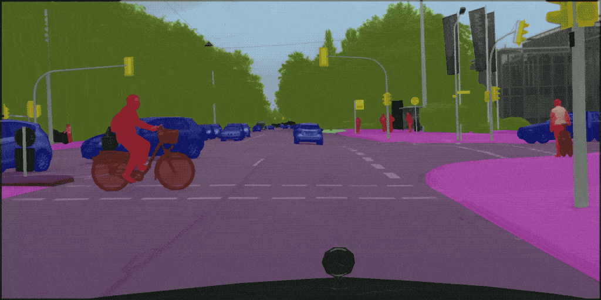

# D3Net (Semantic Segmentation)
This is NNabla implementation of D3Net based semantic segmentation.



## Quick Semantic Segmentation Demo by D3Net

From the Colab link below, you can try running D3Net (D3Net-L/D3Net-S) to generate semantic segmentation outputs for sample input images. Please give it a try!

[](https://colab.research.google.com/github/sony/ai-research-code/blob/master/d3net/semantic-segmentation/D3Net-Semantic-Segmentation.ipynb)

## Getting started

### Prerequisites
* nnabla >= 1.21.0
* cv2
* numpy
* PyYAML >= 5.3

## Inference: Semantic Segmentation with Pre-Trained Model
Two D3Net models are available for Semantic Segmentation inference:
1. `D3Net-S`, smaller model in which D3 blocks are parameterized as (M, L, k, c) = (4, 8, 36, 0.2)
2. `D3Net-L`, larger model in which D3 blocks are parameterized are as (M, L, k, c) = (4, 10, 64, 0.2)

#### Pre-Trained Weights
Pre-trained weights are available for download:

<table>
<tr><th>Pre-trained models</th><th>Metrics from the paper</th></tr>
<tr><td>

| Model | mIoU |
|:-----:|:----:|
| [D3Net-S](https://nnabla.org/pretrained-models/ai-research-code/d3net/semantic-segmentation/D3Net-S.h5) | 79.9 |
| [D3Net-L](https://nnabla.org/pretrained-models/ai-research-code/d3net/semantic-segmentation/D3Net-L.h5) | 81.0 |

</td><td>

| Model | mIoU |
|:-----:|:----:|
| D3Net-S | 79.5 |
| D3Net-L | 80.6 |

</td></tr> </table>

These pre-trained models yield *mIOU* values as mentioned in the above table. The difference in the metrics between pre-trained models and the paper are due to randomness in the data preprocessing and weight initialization.

Note : Evaluation has been done on *Cityscapes val dataset*:
#### Inference Arguments:
| Argument      | Description                                                            | Default      |
|:-------------------:|:---------------------------------------------:|:------------:|
| `--test-image-file` or `-i` | Input file (test/sample image) | `None` |
| `--config-file` or `-cfg` | Configuration file (`D3Net-L` or `D3Net-S`)  | `./configs/D3Net_L.yaml` |
| `--model` or `-m` | Model file (pre-trained model (`D3Net-L.h5` or `D3Net-S.h5`)) | `D3Net-L.h5` |
| `--context` or `-c` | Context (extension modules : `cpu` or `cudnn`) | `cudnn` |

Please Note : Pre-trained weights are from the model trained on `Cityscapes` dataset. So, these models expect CityScapes-like input images for best results.

Run the below command for D3Net-L inference:
```python
 # Assuming test.jpg file in the current directory.
 python infer.py -i ./test.jpg -cfg ./configs/D3Net_L.yaml -m D3Net-L.h5 -c cudnn
 ```
Segmented output will be saved as `result.jpg`

Run the below command for D3Net-S inference:
```python
 # Assuming test.jpg file in the current directory.
 python infer.py -i ./test.jpg -cfg ./configs/D3Net_S.yaml -m D3Net-S.h5 -c cudnn
 ```
Segmented output will be saved as `result.jpg`

## Dataset Preparation:
### Cityscapes
This is the folder structure of Cityscapes dataset:
```
├── cityscapes
│   ├── leftImg8bit
│   │   ├── train
│   │   ├── val
│   ├── gtFine
│   │   ├── train
│   │   ├── val
```

Cityscapes dataset can be downloaded [here](https://www.cityscapes-dataset.com/downloads/) after registration.

It is common convention to use `**labelTrainIds.png**` to train models on Cityscapes dataset.
We generated  `**labelTrainIds.png**` using [scripts available here](https://github.com/open-mmlab/mmsegmentation/blob/master/docs/dataset_prepare.md#cityscapes).

## Training: Semantic Segmentation training with D3Net as backbone network
Like inference, both published D3Net models are available for Semantic Segmentation training as well:
1. `D3Net-S`, smaller model in which D3 blocks are parameterized as (M, L, k, c) = (4, 8, 36, 0.2)
2. `D3Net-L`, larger model in which D3 blocks are parameterized as (M, L, k, c) = (4, 10, 64, 0.2)

#### D3Net backbone network pretrained on ImageNet
We initialize the backbone network with weights pre-trained on ImageNet. They are available for download:
| D3Net-L BackBone | D3Net-S BackBone|
|---|---|
|[D3Net-L backbone weights](https://nnabla.org/pretrained-models/ai-research-code/d3net/semantic-segmentation/D3Net-L-pretrained-backbone.h5)|[D3Net-S backbone weights](https://nnabla.org/pretrained-models/ai-research-code/d3net/semantic-segmentation/D3Net-S-pretrained-backbone.h5)|

#### Training Arguments:
| Argument      | Description                                                            | Default      |
|:-------------------:|:---------------------------------------------:|:------------:|
| `--data-dir` or `-d` | Root path of dataset | `None` |
| `--config-file` or `-cfg` | Configuration file (`D3Net-L` or `D3Net-S`) | `./configs/D3Net_L.yaml` |
| `--pretrained` or `-p` | Path to pre-trained D3Net backbone weights | `None` |
| `--output-dir` or `-o` | Output directory to save model parameters | `./d3net` |
| `--log-interval` | Interval for saving training logs | `50` |
| `--context` or `-c` | Context (extension modules : `cpu` or `cudnn`) | `cudnn` |
| `--recompute` or `-r` | [Reduces the training memory usage at the cost of additional training time](https://blog.nnabla.org/release/v1-20-0/) | `False` |

### Note:
[Recompute](https://nnabla.readthedocs.io/en/latest/python/api/variable.html?highlight=recompute#nnabla.Variable.recompute) is a new feature implemented in NNabla v1.20.0 for training. It deletes the intermediate buffer during forward computation, and recomputes the data required during backward computation. This functionality reduces the memory usage for training at the cost of additional training time.  

Below is the table for comparing the training memory usage without/with `recompute` flag:
| Model | Training Memory (without recompute) | Training Memory (with recompute) |
|:-----:|:-----------------------------------:|:-----------------------------------:|
| D3Net-S | `18GB` | `16GB` |
| D3Net-L | `35GB` | `32GB` |

We encourage users to try enabling `recompute` flag in case of marginal memory bottleneck issue by just passing the argument  
`--recompute` in the below training commands.

### Single-GPU training

Command to train `D3Net-L` model on `Cityscapes` dataset with Single-GPU:
```python
python train.py -d ${Cityscapes Root Path} -cfg ./configs/D3Net_L.yaml -p ${Path to downloaded pretrained weights} -o ./d3net-l -c cudnn
 ```
Command to train `D3Net-S` model on `Cityscapes` dataset with Single-GPU:
```python
python train.py -d ${Cityscapes Root Path} -cfg ./configs/D3Net_S.yaml -p ${Path to downloaded pretrained weights} -o ./d3net-s -c cudnn
 ```

### Distributed Training
For distributed training [install NNabla package compatible with Multi-GPU execution](https://nnabla.readthedocs.io/en/latest/python/pip_installation_cuda.html#pip-installation-distributed).  
Please use the command below to specify GPU device IDs before running training code.
```
export CUDA_VISIBLE_DEVICES=0,1,2,3
```
Command to train `D3Net-L` model on `Cityscapes` dataset with Multi-GPUs:
```python
mpirun -n {no. of devices} python train.py -d ${Cityscapes Root Path} -cfg ./configs/D3Net_L.yaml -p ${Path to downloaded pretrained weights} -o ./d3net-l -c cudnn
 ```
Command to train `D3Net-S` model on `Cityscapes` dataset with Multi-GPUs:
```python
mpirun -n {no. of devices} python train.py -d ${Cityscapes Root Path} -cfg ./configs/D3Net_S.yaml -p ${Path to downloaded pretrained weights} -o ./d3net-s -c cudnn
 ```
 